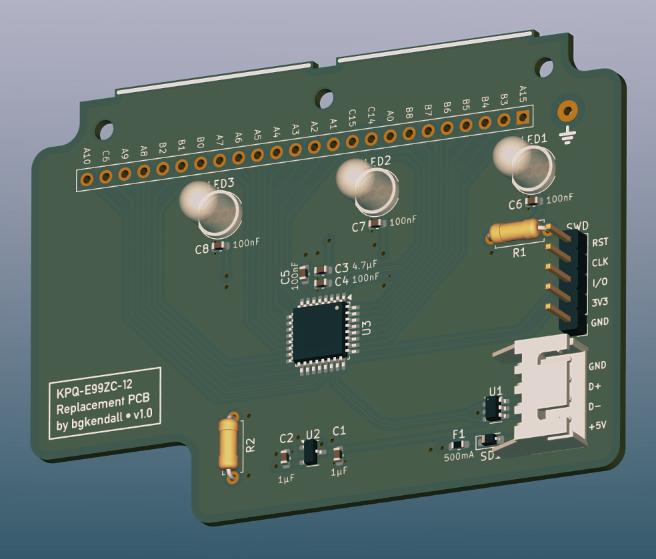

# KPQ-E99ZC-12 Replacement PCB

## About

This is a replacement PCB for the [Mitsumi KPQ-E99ZC] keyboard of the mid-’90s. This new
PCB uses an STM32C071KBT6 or STM32G0B1KBT6 as the MCU. The pin-outs and behaviour of these
chips are the same and it should be possible to use either chip. The STM32C071 is cheaper,
but is currently (as of November 2025) unsupported by QMK and ZMK.

**CAUTION: Currently this PCB has not been produced and is untested.**

## Requirements

 * [KiCad] v9 or later
 * [BGKiCad library]

[Mitsumi KPQ-E99ZC]: https://web.archive.org/web/20240202015834/https://deskthority.net/wiki/Mitsumi_KPQ-E99ZC
[KiCad]: https://www.kicad.org
[BGKiCad library]: https://github.com/bgkendall/BGKiCad